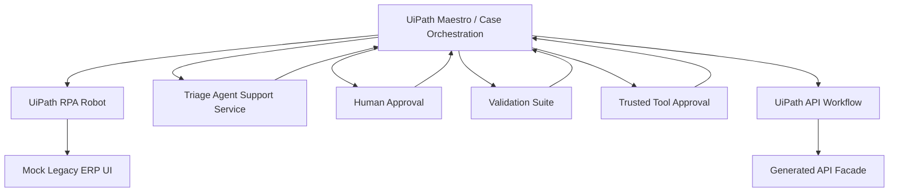

# Agentic ERP Modernization Layer

A UiPath-governed modernization case that turns fragile legacy ERP clicks into validated, human-approved API tools for enterprise agents.

Demo media placeholder: add final screenshot or GIF after recording the UiPath run.

This repository contains hackathon MVP support assets. UiPath remains the main orchestration, governance, approval, RPA, validation, trusted-tool registration, and API-mode execution layer. Python services are callable support assets, demo UI, validation helpers, fixtures, and evidence surfaces only.

The repository includes the support services and UiPath implementation pack. The UiPath process is configured by the human builder in UiPath Studio / Automation Cloud.

## Why This Matters

Many ERP processes begin as fragile UI workflows, not clean APIs. This project shows a controlled path from RPA discovery to validated API-mode execution for one narrow business action: `request_purchase_order_approval`.

The MVP does not claim production ERP modernization. It demonstrates a governance pattern: use UiPath RPA first, classify exceptions, route cases, keep humans in control, validate parity, then approve a trusted API tool.

## Track 1 Alignment

This project maps to UiPath AgentHack Track 1:

- Dynamic exception-heavy workflow
- Case-style lifecycle
- Agents, robots, and humans
- Human-in-the-loop controls
- Stage-based routing
- Auditability and demo evidence
- UiPath as the orchestration and governance layer

See [docs/submission/judging-alignment.md](/home/changv/projects/Uipath/docs/submission/judging-alignment.md).

## Architecture



More diagrams are in [docs/diagrams](/home/changv/projects/Uipath/docs/diagrams).

## Hard MVP

- Mock legacy ERP UI with stable element IDs for UiPath RPA.
- Deterministic triage support service.
- Generated API facade candidate.
- Validation support service.
- UiPath implementation pack with variables, request bodies, expected outputs, selectors, and a template-only XAML skeleton.

## Enhanced MVP

- Case Dashboard
- Case Timeline
- API Readiness Scorecard
- Tool Registry
- Validation failed simulation
- PO-1002 and PO-1003 route proofs
- Demo reset utility
- Submission and demo evidence assets

See [docs/enhanced-mvp.md](/home/changv/projects/Uipath/docs/enhanced-mvp.md).

## Running Locally

```bash
cd /home/changv/projects/Uipath
python3.11 -m venv .venv
source .venv/bin/activate
pip install -r requirements.txt
chmod +x scripts/*.sh
./scripts/start_all.sh
```

Windows/UiPath URLs:

- `http://localhost:8000`
- `http://localhost:8001`
- `http://localhost:8002`
- `http://localhost:8003`

Run tests:

```bash
.venv/bin/python -m pytest mock-legacy-erp reasoning-agent generated-api-facade validation-suite
```

Run smoke tests:

```bash
./scripts/smoke_test.sh
```

Reset demo data:

```bash
./scripts/reset_demo_data.sh
```

Optional Docker Compose:

```bash
docker compose up --build
```

See [docs/docker-run.md](/home/changv/projects/Uipath/docs/docker-run.md).

## Service Endpoints

| Service | URL | Purpose |
| --- | --- | --- |
| Mock legacy ERP | `http://localhost:8000` | Legacy UI and demo evidence pages |
| Triage support service | `http://localhost:8001/triage` | Structured exception classification |
| Generated API facade | `http://localhost:8002/api/purchase-orders/{po_id}/approval-request` | API candidate after validation and approval |
| Validation suite | `http://localhost:8003/validate/request-purchase-order-approval` | Contract, rule, and parity evidence |

Enhanced evidence pages:

- `http://localhost:8000/case-dashboard`
- `http://localhost:8000/case-timeline/CASE-001`
- `http://localhost:8000/api-readiness-scorecard`
- `http://localhost:8000/tool-registry`

## UiPath Implementation Pack

UiPath builder assets are in [uipath-workflows/README.md](/home/changv/projects/Uipath/uipath-workflows/README.md). The pack includes workflow outlines, variable tables, request bodies, expected outputs, selector notes, troubleshooting, runbook material, and a template-only XAML skeleton.

## Demo Flow

1. UiPath creates the modernization case.
2. UiPath RPA opens the mock ERP UI and extracts PO fields.
3. UiPath calls the triage support service.
4. UiPath routes by `detected_exception_type`, not hardcoded PO ID.
5. UiPath handles human approval.
6. UiPath performs RPA write-back through the legacy UI.
7. UiPath calls the validation suite.
8. UiPath gates trusted-tool registration.
9. UiPath switches the approved path to API mode.
10. Demo evidence pages show dashboard, timeline, scorecard, registry, and final output.

## Validation / Parity

The validation suite simulates:

- Contract test
- Business rule test
- RPA/API parity check using cloned/reset test cases
- Failed validation recovery recommendation

If `simulate_failure` is true, the validation suite returns a failed parity branch and recommends staying in RPA mode.

## Coding Agent Usage

Codex generated support services, fixtures, scripts, documentation, diagrams, and implementation aids. Codex did not operate UiPath Studio, did not configure the tenant, did not modify production ERP code, and does not run at UiPath runtime in this demo.

## Human Builder Responsibilities

- Create UiPath process / app / case-style flow
- Configure browser automation
- Pick UI elements in Chrome
- Configure HTTP Request activities
- Configure human approval steps
- Configure trusted-tool approval
- Run attended robot
- Capture UiPath screenshots/video

## Limitations

- Mock ERP, not real ERP
- Deterministic triage in MVP
- Demo-grade validation simulation
- API facade uses demo data layer
- No production deployment
- No production ERP code modification
- UiPath workflow still configured by a human builder

See [docs/submission/risk-and-limitations.md](/home/changv/projects/Uipath/docs/submission/risk-and-limitations.md).

## Roadmap

- More exception branches
- Real Maestro case integration
- UiPath Apps dashboard
- UiPath Data Service / Orchestrator queues
- Production-grade validation suite
- Security, RBAC, and connector hardening
- Governed tool registry with access control
- Real ERP adapter patterns
- Optional LangGraph consumer
- Optional Codex Record & Replay evidence

## Repository Structure

```text
mock-legacy-erp/          Legacy UI simulation and evidence pages
reasoning-agent/          Deterministic triage support service
generated-api-facade/     API candidate support service
validation-suite/         Validation support service
uipath-workflows/         UiPath implementation pack
docs/                     Guides, diagrams, submission docs
scripts/                  Start, smoke, reset, CI helpers
.github/workflows/        GitHub Actions CI
docker-compose.yml        Optional support-service container runner
```
